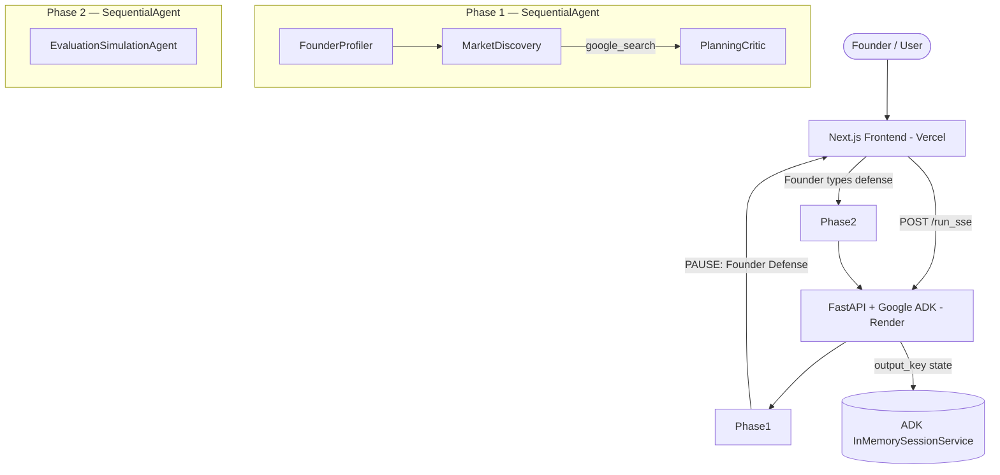

# Future Founder Twin

[](https://www.kaggle.com/competitions/vibecoding-agents-capstone-project)
[](https://github.com/google/agent-development-kit)
[](https://nextjs.org/)
[](https://fastapi.tiangolo.com/)

**Future Founder Twin** is an agentic AI co-founder designed to ruthlessly evaluate your startup ideas *before* you write a single line of code. Built for the **Kaggle × Google "Agents for Business" Capstone**, this project uses a 4-agent orchestration pipeline to research live markets, identify execution risks, and calculate a quantitative Founder-Idea Fit score.

Most startups fail because founders build products nobody wants. This tool acts as an adversarial, highly analytical sparring partner — not a cheerleader.

---

## 🏗️ Architecture

The system uses the **Google Agent Development Kit (ADK)** to orchestrate 4 specialized agents across two phases. After Phase 1, the pipeline **pauses** and forces the founder to defend their idea against the Planning & Critique agent's critical question before Phase 2 generates the final evaluation and Investor Brief.



**Architectural Decision:** We intentionally consolidated closely related responsibilities (Planner + Critic) into four specialized agents to reduce latency, lower token usage, and improve maintainability while preserving clear agent boundaries and ADK orchestration.

---

## 🤖 The 4-Agent Pipeline

Our application moves beyond a simple "chatbot" by chaining specialized agents and passing state via the ADK `InMemorySessionService`:

1. **Founder Profiler** — Extracts technical skills, runway, and constraints from the user's 5-question interview via a custom `save_founder_profile` tool.
2. **Market Discovery** — Actively calls the `google_search` tool (3× searches) to fetch live competitor data and estimate market size from real sources.
3. **Planning & Critique** — A dual-persona agent: first designs a realistic MVP, then switches into an independent critic role to identify the biggest execution flaws, ending with a mandatory critical question.
   - ⏸️ **HUMAN-IN-THE-LOOP PAUSE:** The founder must read the risk assessment and write an active defense before Phase 2 begins.
4. **Evaluation & Simulation** — Reads the founder's defense + all prior state. Scores the founder across 4 dimensions (0–25 each), simulates 3 future timelines, and generates the final Investor Brief with a **PURSUE / PIVOT / PAUSE** verdict.

---

## ✨ Features

| Feature | Description |
| :--- | :--- |
| Live Glowing Pipeline UI | Real-time SSE stream visualized as an animated agent pipeline track |
| Live Google Search Grounding | Market Discovery calls `google_search` 3× for real, cited market data |
| Human-in-the-Loop Defense Gate | Pipeline pauses; Phase 2 cannot start without the founder's typed defense |
| Quantitative Founder Fit Matrix | 4-dimension scoring enforced via structured custom tool calls |
| 3-Timeline Simulation | Optimistic, Realistic, and Conservative projections with milestones |
| Investor Brief Generator | Structured 13-field brief with color-coded PURSUE/PIVOT/PAUSE verdict |
| Session Memory & History | `localStorage` + ADK session recall; "Welcome back" resume banner |
| Demo Presets | One-click pre-filled scenarios for judges to instantly test the pipeline |
| API Key Rotation & Model Fallback | Auto-rotates across 3 keys and 6 model fallbacks on rate limits |

---

## 🚀 Local Development Setup

### Prerequisites
- Python 3.10+
- Node.js 18+
- A Google Gemini API key ([get one free](https://aistudio.google.com/app/apikey))

### 1. Clone the Repository

```bash
git clone https://github.com/justinsaju21/future-founder-twin-adk.git
cd future-founder-twin-adk
```

### 2. Backend Setup (FastAPI + Google ADK)

```bash
cd backend
python -m venv .venv

# Activate the virtual environment:
# Windows:
.venv\Scripts\activate
# macOS / Linux:
source .venv/bin/activate

pip install -r requirements.txt
```

**Configure API Keys:**

Create a `.env` file in the `backend/` directory:

```env
GOOGLE_API_KEY=your_gemini_api_key_here
GOOGLE_API_KEY_2=your_second_api_key_here   # Optional — used for rate limit rotation
GOOGLE_API_KEY_3=your_third_api_key_here    # Optional — used for rate limit rotation
```

> ⚠️ **Rate Limits (Free Tier):** Running 4 agents sequentially with live Google Search can hit Gemini's free-tier RPM limits. The backend automatically rotates keys and falls back through 6 model variants on a 429 error. Adding 2–3 API keys is strongly recommended.

**Start the Backend:**

```bash
python main.py
# Runs on http://localhost:8000
# Health check: http://localhost:8000/health
```

### 3. Frontend Setup (Next.js)

```bash
cd frontend
npm install
npm run dev
# Runs on http://localhost:3000
```

### Troubleshooting

| Problem | Solution |
| :--- | :--- |
| `Failed to fetch` in UI | Ensure the backend is running on port 8000 |
| Pipeline hangs / 429 error | Add more API keys to `.env`; wait ~1 min for quota reset |
| `GOOGLE_API_KEY not set` warning | Check your `backend/.env` file exists and is populated |

---

## ☁️ Production Deployment

| Service | Platform | Notes |
| :--- | :--- | :--- |
| **Frontend** | [Vercel](https://vercel.com) | Set `NEXT_PUBLIC_ADK_BACKEND_URL` env var to your Render backend URL |
| **Backend** | [Render](https://render.com) | Set `GOOGLE_API_KEY`, `PORT` env vars; start command: `python main.py` |

The backend exposes a `/health` endpoint used by Render for liveness checks.

---

## 🏆 Kaggle Rubric Alignment

| Course Concept | Implementation |
| :--- | :--- |
| **Multi-Agent Systems (ADK)** | 4 `LlmAgent` instances in 2 `SequentialAgent` phases (`agent.py:130-182`) |
| **Tool Usage** | `google_search` (ADK native) + 3 custom Python tools (`tools.py`) |
| **Sessions & State** | `InMemorySessionService` persists `output_key` state across all agents (`main.py:4`) |
| **Streaming** | Frontend reads raw SSE from `/run_sse`, filters thought tokens in real time (`adk.ts:46-121`) |
| **Security Features** | `RotatingFallbackLlm` rotates API keys safely; no keys hardcoded (`agent.py:24-43`) |
| **Deployability** | Render (backend) + Vercel (frontend); `/health` endpoint for monitoring (`main.py:46-48`) |
| **Evaluation** | Quantitative 4-dimension scoring enforced via `calculate_founder_fit_score` tool |
| **Human-in-the-Loop** | Mandatory Phase 1 → defense → Phase 2 gate; no bypass possible |

---

*Built by Team Future Founder Twin for the Kaggle × Google AI Agents Intensive.*
